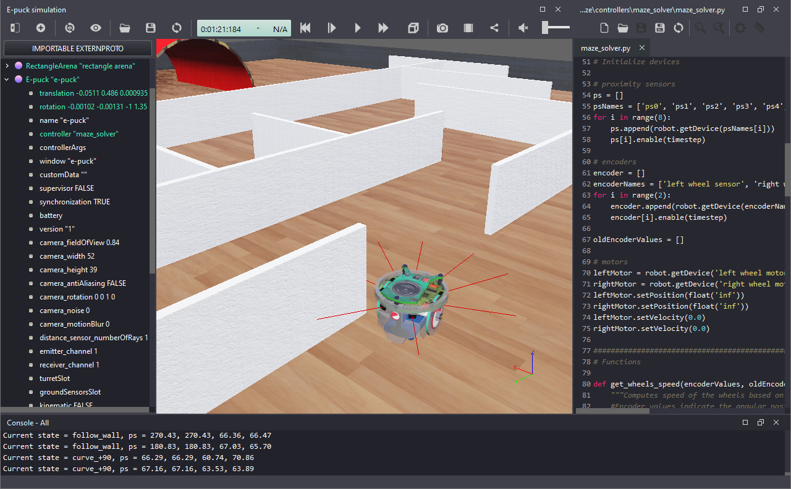

# Εργαστήριο Προσομοίωσης Ρομποτικών Συστημάτων

Σε αυτή τη σελίδα, μπορείτε να βρείτε μια συλλογή από εργαστηριακές ασκήσεις προσομοίωσης ρομποτικών συστημάτων με τη βοήθεια του προσμοιωτή [Webots](https://cyberbotics.com/) και της γλώσσας προγραμματισμού [Python](https://www.python.org/). 

